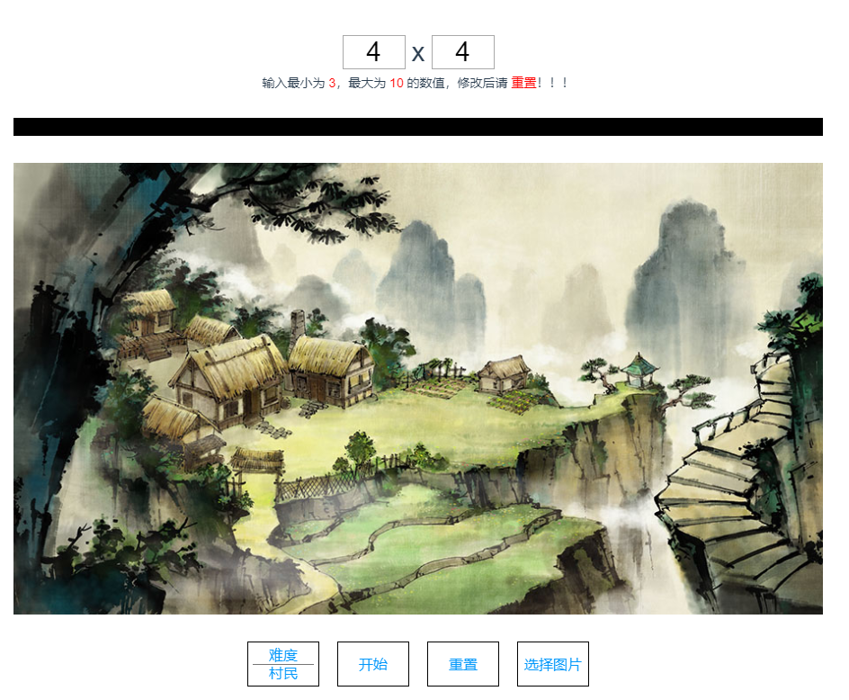
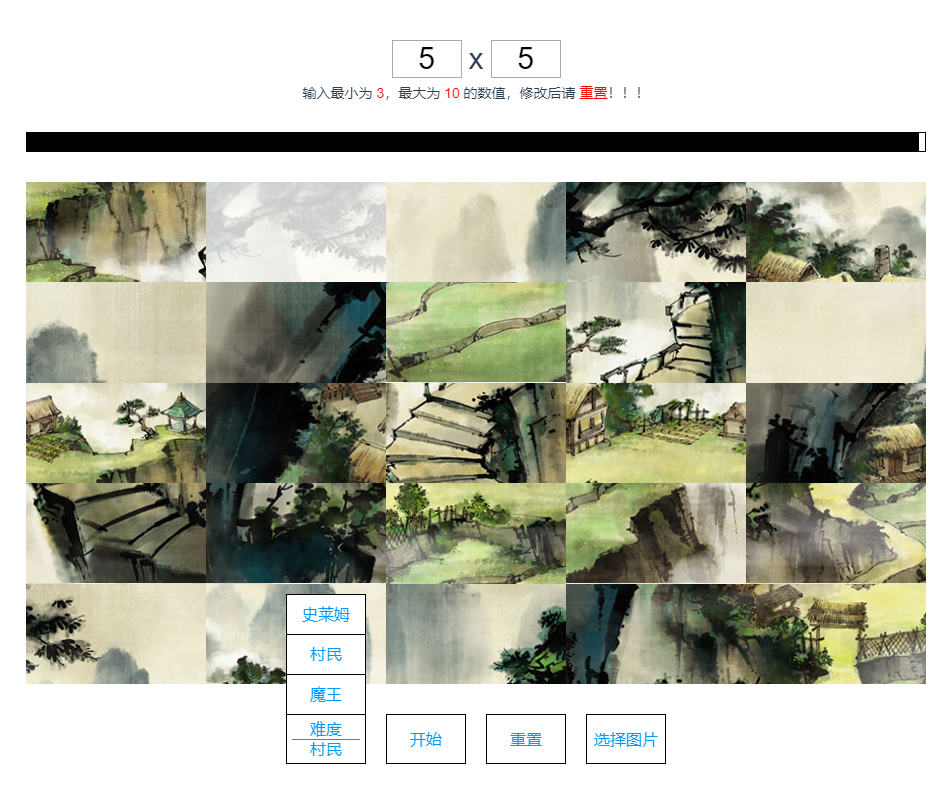

# huarongdao

> Vue开发的华容道小游戏

## 启动

``` bash
npm install
npm run dev
打开浏览器localhost:8080
```

## 技术实现

把选中的图片，用canvas重绘成符合预定宽度的图画，然后把canvas装换成base64，接着用flex弹性盒子分割成N x N的方块，每个方块以base64为背景图片，用background-position实现方块和整个图画位置的一一对应，最后通过flex的order的替换来实现方块的移动。

还实现了游戏的倒计时，以及自定义选择图片。

具体逻辑和实现过程请看代码。

## 效果展示


